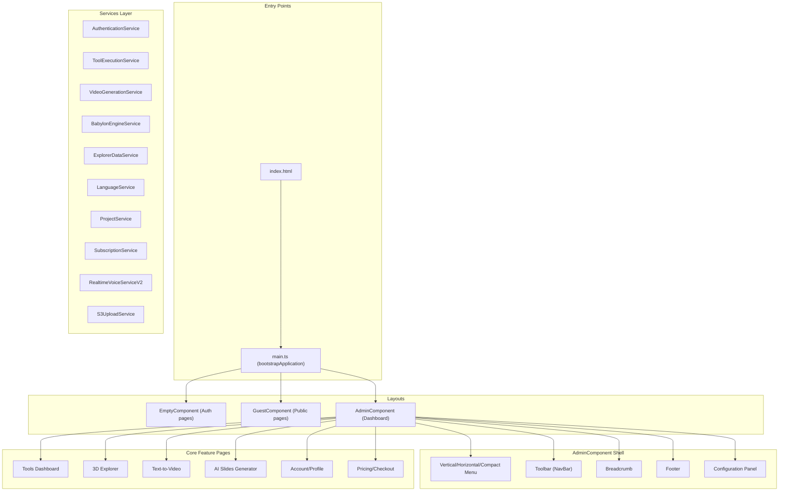
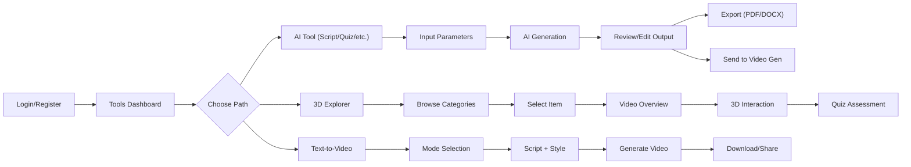

# LRNOVA UserDashboard — Full Codebase Analysis & Visual Feedback Report

> **Domain:** Educational Technology (EdTech) with AI  
> **Product:** AI-powered course creation & learning platform  
> **Date:** May 17, 2026

---

## 1. Tech Stack Overview

| Layer | Technology | Version | Purpose |
|-------|-----------|---------|---------|
| **Framework** | Angular | 20.0.5 | Core SPA framework (latest) |
| **UI Library** | Angular Material (CDK) | 20.0.4 | Component library + theming |
| **Styling** | SCSS + Material Theming | — | 11 color themes (light/dark) |
| **3D Engine** | BabylonJS | 9.3.1 | Interactive 3D model viewer |
| **3D Preview** | Google Model Viewer | 3.4.0 | Lightweight GLB previews |
| **State** | Angular Signals + RxJS | 7.8.2 | Reactive state management |
| **Auth** | JWT + Firebase Auth | 11.10 | Login/register + social (Google) |
| **i18n** | ngx-translate | 16.0.4 | English + Arabic (full RTL) |
| **Rich Text** | ngx-quill (Quill 2) | 28.0.1 | WYSIWYG editor for scripts |
| **Markdown** | ngx-markdown + marked | 20.1 / 16.4 | Render AI output as markdown |
| **PDF Export** | pdfmake | 0.2.20 | Export tool outputs to PDF |
| **DOCX Export** | docx + file-saver | 9.5.1 | Export tool outputs to Word |
| **Voice AI** | OpenAI Realtime API (WebRTC) | GPT-4o-realtime | Voice chatbot (direct SDP) |
| **File Upload** | AWS S3 Presigned URLs | — | Reference files & audio |
| **Fonts** | Inter, Cairo, Almarai | — | Latin + Arabic typography |
| **Icons** | Material Icons, Tabler, FontAwesome, Custom SVG | — | Multi-icon system |
| **Build** | Angular CLI + Webpack | 20.0.4 | Dev server + production build |
| **Deploy** | Docker + Nginx | — | Containerized static hosting |
| **Linting** | ESLint + Prettier | 9.29 / 3.6 | Code quality |
| **Captcha** | ngx-captcha + reCAPTCHA v2 | 14.0 | Registration protection |

### Architecture Pattern
- **Standalone Components** (Angular 20 style) — most pages use `loadComponent` lazy loading
- **Barrel exports** via `index.ts` in `@theme/models/`
- **HTTP Interceptor chain**: Language → BasicAuth → Error → Refresh
- **Template:** Based on "Able Pro Angular Material" template v3.2.0, heavily customized

---

## 2. Application Architecture



---

## 3. Feature Extraction (Complete)

### 3.1 AI-Powered Content Generation Tools (12 Tools)

| # | Tool | ID | Route | Purpose |
|---|------|----|-------|---------|
| 1 | Full Course Script Generator | 1 | `/tools/full-course-script-tool/:id` | Generate complete course scripts |
| 2 | Single Video Script Generator | 2 | `/tools/single-video-script-tool/:id` | Script for a single video |
| 3 | Assessment Generator | 3 | `/tools/assessment-tool/:id` | Quiz/exam generation |
| 4 | Pre/Post Assessment Generator | 4 | `/tools/pre-post-assessment-tool/:id` | Before/after learning tests |
| 5 | Video AI Generator (Avatar) | 5 | `/tools/video-ai-generator/:id` | Avatar-based video generation |
| 6 | Topic Generator | 6 | `/tools/topic-generator-tool/:id` | Course topic brainstorming |
| 7 | Activity Generator | 7 | `/tools/activity-generator-tool/:id` | Learning activities creation |
| 8 | Slides Generator | 8 | `/tools/slides-generator-tool/:id` | Presentation slides from content |
| 9 | Full Course Content Generator | 9 | `/tools/full-course-content-tool/:id` | Complete course material |
| 10 | Full Course Slides Tool | 10 | `/tools/full-course-slides-tool/:id` | Course-level slides |
| 11 | Full Course Assessment Tool | 11 | `/tools/full-course-assessment-tool/:id` | Course-level assessments |
| 12 | Training Kit | 12 | `/tools/training-kit/:id` | Complete training package |

**Tool Execution Pattern:**
- Each tool uses `ToolExecutionService` → `POST /api/{ToolName}/create-or-regenerate`
- Update via `PUT /api/{ToolName}/update`
- JSON input/output with typed parsing (`SingleVideoScriptResponse`, `CourseScriptResponse`, etc.)
- AI normalizes literal `\n` sequences in responses

### 3.2 3D Interactive Explorer (Learning Journey)

| Feature | Implementation |
|---------|---------------|
| **Category Grid** | Browse models by category (vehicles, engines, etc.) |
| **Item Grid** | View items within a category with thumbnails |
| **3D Model Viewer** | BabylonJS: load GLB, ArcRotateCamera, PBR lighting |
| **Disassemble/Explode View** | Animated part separation with smooth lerp |
| **Wireframe Toggle** | Material wireframe mode |
| **Auto-Rotate** | Camera alpha rotation at 0.003 rad/frame |
| **Part Tooltips** | Hover-based mesh picking with bilingual descriptions |
| **Zoom to Part** | Camera targets individual mesh bounding box |
| **Video Overview** | Embedded learning video per item |
| **Quiz Assessment** | Interactive quiz + AI evaluation report |
| **Learning Journey Stepper** | Overview → Assessment (2-step navigation) |

### 3.3 Text-to-Video Generation

| Feature | Detail |
|---------|--------|
| **5 Video Styles** | Realistic, Infographic, 3D Cartoon, Whiteboard, 2D Animation |
| **Script Input** | 20–2000 char, with optional notes |
| **Style Selection** | Visual cards with preview images |
| **Progress Animation** | Fake timer-based progress bar (0–90% random, then 100%) |
| **AI Script Integration** | Script from Single Video Script Tool auto-populates via `VideoGenerationIntentService` |
| **Sub-components** | Mode Selector → Stepper → Result (3-stage flow) |

### 3.4 Voice AI Chatbot (WebRTC)

| Feature | Detail |
|---------|--------|
| **Protocol** | Direct WebRTC to OpenAI Realtime API |
| **Auth** | Ephemeral token from backend `/api/Contact/realtime-token` |
| **Voice** | Whisper-1 transcription (Arabic), GPT-4o-realtime |
| **Features** | Microphone muting during AI speech, VAD turn detection |
| **UI** | Video chatbot component (~20KB TS, ~24KB SCSS) |

### 3.5 Authentication & User Management

| Feature | Detail |
|---------|--------|
| **Login** | Email/password + Firebase (Google social login) |
| **Register** | With reCAPTCHA protection |
| **Token Management** | JWT access token + HttpOnly refresh cookie |
| **Refresh** | Coordinated concurrent refresh with BehaviorSubject |
| **Profile** | Update name, phone, company, industry, gender |
| **Password** | Change password + forgot/reset password flow |
| **Roles** | Admin / User role-based menu filtering |

### 3.6 Projects & Subscriptions

| Feature | Detail |
|---------|--------|
| **Projects** | CRUD with pagination, rename, delete |
| **Recent Creations** | Dashboard widget showing latest work |
| **Plans** | Region-resolved pricing (country code → currency) |
| **Free Plan** | Activate free subscription |
| **Promo Codes** | Activate paid plan via promo |
| **Usage Tracking** | Tenant usage statistics per billing period |
| **Checkout** | Payment flow with return handling |

### 3.7 Export Capabilities

- **PDF Export** (pdfmake)
- **DOCX Export** (docx + file-saver)
- **Markdown rendering** (ngx-markdown)

### 3.8 Internationalization (i18n)

| Aspect | Detail |
|--------|--------|
| **Languages** | English (35KB), Arabic (45KB) — full coverage |
| **RTL Support** | Full RTL layout with `dir="rtl"`, class `able-pro-rtl` |
| **Fonts** | Inter (Latin), Cairo + Almarai (Arabic) |
| **Dynamic Switching** | Signal-based, persisted to localStorage |
| **Bilingual Data** | Explorer items have `nameEn/nameAr`, `descriptionEn/descriptionAr`, `partsAr` |

---

## 4. UI/UX Analysis

### 4.1 Presentation & Visual Design

| Aspect | Current State | Rating |
|--------|--------------|--------|
| **Theme System** | 11 color themes (blue, indigo, purple, pink, red, orange, yellow, green, teal, cyan) × light/dark = 22 variants | ⭐⭐⭐⭐⭐ |
| **Typography** | Inter (body), Cairo/Almarai (Arabic) — professional | ⭐⭐⭐⭐ |
| **Custom Cursor** | Black arrow default, purple `#6414FF` for interactive elements | ⭐⭐⭐⭐ |
| **Loading States** | Material progress bar (indeterminate) on navigation | ⭐⭐⭐ |
| **Animations** | `animate.css` imported, custom cursor lerp trail | ⭐⭐⭐ |
| **Material Design** | Full Angular Material theming integration | ⭐⭐⭐⭐ |
| **Responsive** | Breakpoint observer (1024px), drawer mode switching | ⭐⭐⭐ |

### 4.2 Sequence / User Flow



### 4.3 View Count / Dashboard Metrics

**Current dashboard sections:**
1. **Quick Actions Grid** — 4 cards (Full Course Script, Single Video Script, Slides, Full Course Content)
2. **Hero Banner** — Auto-playing 4K video from S3 + CTA button for Video AI Generator
3. **Recent Creations** — Paginated list (4 items/page) via `LastCreationsComponent`

### 4.4 Color System

| Theme | Primary Color | Use Case |
|-------|--------------|----------|
| Blue (default) | Material Blue | Standard dashboard |
| Indigo | Deep Indigo | Professional feel |
| Purple | Purple `#6414FF` | Brand accent (cursor) |
| Pink | Material Pink | Creative tools |
| Red/Orange/Yellow | Warm tones | Alert states |
| Green/Teal/Cyan | Cool tones | Success/learning |

**Dark mode:** Each theme has a dedicated dark palette (`theme-dark-palette-colors.scss`).

---

## 5. Competitive Analysis: LRNOVA vs. HeyGen vs. Replit

### 5.1 Feature Comparison

| Feature | LRNOVA | HeyGen | Replit |
|---------|--------|--------|--------|
| **AI Content Generation** | ✅ 12 tools (scripts, quizzes, slides, topics) | ❌ Video-only | ❌ Code-only |
| **Video Generation** | ✅ Text-to-video + avatar | ✅ Best-in-class avatar video | ❌ |
| **3D Interactive Learning** | ✅ BabylonJS explorer + explode view | ❌ | ❌ |
| **Voice AI Chatbot** | ✅ OpenAI Realtime WebRTC | ❌ | ❌ |
| **Multi-language (RTL)** | ✅ Full EN/AR RTL | ✅ 175+ languages (video) | ❌ |
| **Learning Journey** | ✅ Video → 3D → Quiz pipeline | ❌ | ❌ |
| **Collaborative UI** | ❌ Single user | ✅ Team workspaces | ✅ Multiplayer |
| **Real-time Preview** | ✅ 3D model, video | ✅ Video preview | ✅ Live app preview |
| **Export Options** | ✅ PDF, DOCX, Markdown | ✅ MP4, MP3 | ✅ Deploy to web |
| **Subscription/Pricing** | ✅ Plans + promo codes | ✅ Credits system | ✅ Cycles |

### 5.2 UX Patterns Comparison

| Pattern | LRNOVA | HeyGen | Replit |
|---------|--------|--------|--------|
| **Onboarding** | Login → Dashboard → Tools | Guided webcam → Video | Prompt → Build |
| **Primary Interaction** | Form-based input → AI output | Script panel → Avatar | Chat → Code |
| **Progress Feedback** | Progress bar (fake %) | Real render status | Checkpoint system |
| **Result Display** | Markdown render + edit | Video player | Live preview |
| **Navigation** | Sidebar menu (3 layouts) | Tab-based workflow | File tree + chat |

---

## 6. Pros & Cons

### ✅ PROS

| # | Strength | Detail |
|---|----------|--------|
| 1 | **Comprehensive AI Toolkit** | 12 specialized tools covering the full course creation lifecycle — unique in EdTech |
| 2 | **3D Learning Experience** | BabylonJS integration with explode view, tooltips, and quiz — innovative and engaging |
| 3 | **Full RTL/Arabic Support** | Not just translated text but full layout RTL, Arabic fonts, bilingual 3D part labels |
| 4 | **Modern Tech Stack** | Angular 20 with Signals, standalone components, latest Material — cutting edge |
| 5 | **Voice AI Integration** | WebRTC direct-to-OpenAI for real-time voice interaction — advanced feature |
| 6 | **Multi-theme System** | 22 theme variants (11 colors × light/dark) — exceptional customization |
| 7 | **Export Flexibility** | PDF + DOCX + Markdown — covers all educator needs |
| 8 | **Strong Auth Architecture** | JWT + HttpOnly cookies + refresh coordination — production-grade security |
| 9 | **Custom Cursor** | Branded purple cursor for interactive elements — premium feel |
| 10 | **Tool Interconnection** | Single Video Script → Text-to-Video flow via IntentService — smart UX |

### ❌ CONS

| # | Weakness | Detail | Priority |
|---|----------|--------|----------|
| 1 | **No Real-time Progress** | Video generation uses fake timer (random %) instead of real job polling | 🔴 High |
| 2 | **2D Animation Hardcoded** | `2d_animation` style returns a hardcoded S3 URL instead of real generation | 🔴 High |
| 3 | **Template Remnants** | "Able Pro" template code visible (menu.ts has sample/maintenance pages, `able-pro` in angular.json) | 🟡 Medium |
| 4 | **No Collaborative Features** | Single-user only — no shared workspaces or real-time collaboration | 🟡 Medium |
| 5 | **Limited Dashboard Analytics** | No view counts, usage graphs, or performance metrics on dashboard | 🟡 Medium |
| 6 | **No Onboarding Flow** | New users land on login — no guided tour or tutorial | 🟡 Medium |
| 7 | **Incomplete i18n** | `cn.json`, `fr.json`, `ro.json` exist but only ~700 bytes each (skeleton files) | 🟢 Low |
| 8 | **Stale Menu Config** | `menu.ts` has legacy items (Error 404/500, Under Construction, Coming Soon, Document link to Able Pro) | 🟢 Low |
| 9 | **Bundle Size Risk** | 5MB initial budget with heavy deps (BabylonJS, Quill, Firebase, pdfmake) | 🟢 Low |
| 10 | **No Offline Support** | No service worker or PWA capabilities | 🟢 Low |

---

## 7. Recommendations (Inspired by HeyGen, Replit & Agentic AI Patterns)

### 7.1 UX Improvements

| # | Recommendation | Inspired By | Impact |
|---|---------------|-------------|--------|
| 1 | **Add real job status polling** for video generation instead of fake progress | HeyGen | 🔴 Critical |
| 2 | **Guided onboarding flow** — interactive tour for first-time users showing tool capabilities | Replit | 🟡 High |
| 3 | **Split-screen "Chat + Preview"** layout for AI tools — show conversation on left, live preview on right | Agentic AI patterns | 🟡 High |
| 4 | **Dashboard analytics** — add usage charts, generation counts, project statistics | HeyGen Business | 🟡 High |
| 5 | **Checkpoint/version system** for AI outputs — allow "rollback" to previous generations | Replit | 🟡 Medium |
| 6 | **AI reasoning transparency** — show the AI's "thought process" during generation | Agentic AI patterns | 🟡 Medium |
| 7 | **Proactive nudges** — suggest next tools based on what user just created | EdTech patterns | 🟢 Nice-to-have |

### 7.2 Visual Design Improvements

| # | Recommendation | Detail |
|---|---------------|--------|
| 1 | **Micro-animations** on tool cards — hover scaling, icon morph, shimmer loading skeletons | 
| 2 | **Glassmorphism cards** for the quick actions grid — frosted glass effect with backdrop-filter |
| 3 | **Animated step indicators** for the Learning Journey — pulse effect on active step |
| 4 | **Video thumbnail previews** with play overlay instead of bare video elements |
| 5 | **Clean up template artifacts** — remove Able Pro branding, sample pages, and unused menu items |

### 7.3 Feature Additions

| # | Feature | Priority |
|---|---------|----------|
| 1 | **Team workspaces** — shared projects with role-based access | 🟡 |
| 2 | **Content library** — save and reuse generated scripts/quizzes | 🟡 |
| 3 | **AI course planner** — goal-based: "I want to teach X" → auto-generates full course structure | 🟡 |
| 4 | **Learning analytics** — track student quiz performance, video watch time | 🟡 |
| 5 | **Mobile-responsive 3D** — optimize BabylonJS for touch/mobile | 🟢 |

---

## 8. Codebase Structure Summary

```
src/
├── app/
│   ├── @theme/                    # Core framework layer
│   │   ├── components/            # 15 shared components (breadcrumb, card, chatbot, etc.)
│   │   ├── constants/             # Tool IDs, menu config
│   │   ├── helpers/               # Auth guard, interceptors (4), utilities
│   │   ├── layouts/               # Toolbar, menu (vertical/horizontal/compact), footer
│   │   ├── models/                # 42+ TypeScript models (tools, explorer, auth, subscription)
│   │   ├── services/              # 27+ services (auth, tools, video, babylon, etc.)
│   │   ├── styles/                # SCSS themes (11 palettes), Material overrides, RTL, grid
│   │   └── types/                 # Navigation, Role, Product types
│   ├── demo/
│   │   ├── data/                  # Static data (menu, explorer items ~145KB, tech data)
│   │   ├── layout/                # Admin, Empty, Guest, Component layouts
│   │   ├── pages/                 # All feature pages
│   │   │   ├── 3d-explorer/       # 9 sub-components (categories, items, learning journey, etc.)
│   │   │   ├── tools/             # 16 tool components
│   │   │   ├── auth/              # Login, register, forgot password
│   │   │   ├── account/           # Profile, change password, subscriptions
│   │   │   ├── pricing/           # Plans + checkout
│   │   │   ├── payment/           # Payment return handler
│   │   │   ├── contact-us/        # Contact form
│   │   │   ├── legal/             # Terms & privacy policy
│   │   │   └── maintenance/       # Error pages
│   │   └── shared/                # Shared module, custom translate loader, social login
│   └── shared/                    # Global shared (floating contact, contact service)
├── assets/
│   ├── i18n/                      # en.json (35KB), ar.json (45KB), stubs (cn/fr/ro)
│   ├── images/                    # Logos, icons, video styles, avatars
│   ├── fonts/                     # Inter, FontAwesome, Material, Tabler, custom SVGs
│   └── voices/                    # Voice samples
├── environments/                  # API URLs, Firebase config, OpenAI config
├── scss/                          # Global SCSS (_common, _generic, _variables)
└── styles.scss                    # Master stylesheet (179 lines, 22 theme combos)
```

---

## 9. Key Methodology Observations

### How the Tool Execution Pipeline Works
1. **User fills form** → dynamic inputs from `ToolInput[]` model (backend-driven)
2. **Frontend serializes** → `ToolExecutionRequest { toolId, inputParametersJson }`
3. **POST to specific endpoint** → e.g., `/api/SingleVideoScriptTool/create-or-regenerate`
4. **Backend returns** → `ToolExecutionResponse { outputPayloadJson }` (raw JSON string)
5. **Frontend parses** → `parseJson()` with `Object.assign` + `normalizeNewlines()`
6. **Renders in UI** → Markdown/Quill editor for editing
7. **User can update** → `PUT /update` sends modified `outputPayloadJson` back
8. **Export** → PDF/DOCX via `pdfmake`/`docx`

### How the 3D Explorer Works
1. **Static data** in `explorer.data.ts` (145KB!) defines categories, items, GLB paths, parts, quizzes
2. **ExplorerDataService** localizes items based on current language
3. **BabylonEngineService** loads GLB → `LoadAssetContainerAsync` → adds to scene
4. **Explode view** calculates direction vectors from mesh center → scene center
5. **Tooltips** use `scene.pick()` on pointer move during disassemble mode
6. **Learning Journey** follows Overview → (Exploration disabled) → Assessment sequence

### How Video Generation Works
1. **Script input** (manual or from AI tool via `VideoGenerationIntentService`)
2. **Style selection** (5 visual styles)
3. **Submit to backend** via `VideoGeneratorService.generateStandaloneTextToVideo()`
4. **Backend queues to SQS** → processes asynchronously → stores result on S3
5. **Frontend shows fake progress** (should use real polling from `getJobStatus()`)

---

> [!IMPORTANT]
> **Key Takeaway:** LRNOVA has an exceptionally rich feature set for EdTech — 12 AI tools, 3D interactive learning, voice AI, and full Arabic support. The main gaps are in **real-time feedback** (fake progress bars), **collaboration** (single-user only), and **polish** (template remnants). Addressing these would bring it on par with premium platforms like HeyGen and Replit in terms of UX quality.
